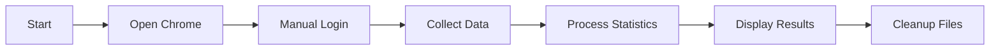

# 🎮 Dotabuff Match Analyzer

[](https://nodejs.org/)
[](https://playwright.dev/)
[](https://www.typescriptlang.org/)
[](LICENSE)

An automated tool to collect and analyze match statistics from Dotabuff using Playwright. This project demonstrates web automation, data scraping, and handling pages with login requirements and security verification.

## ✨ Features

- 🤖 **Playwright Automation** - Automated browsing of Dotabuff
- 📊 **Data Collection** - Extracts match information (hero, result, etc.)
- 🔐 **Login Support** - Manual login to bypass security checks
- 📈 **Statistical Analysis** - Generates detailed hero statistics
- 🎯 **Multiple Pages** - Processes multiple pages of match history
- 🖼️ **Visual Debugging** - Saves screenshots for issue diagnosis

## 🚀 Demo Output

```bash
🏆 TOP 10 MOST PLAYED HEROES:
--------------------------------------------------
Pudge               45 games (28W/17L - 62%)
Invoker             38 games (20W/18L - 53%)
Shadow Fiend        35 games (22W/13L - 63%)
...

📈 GENERAL STATISTICS:
------------------------------
✅ Wins:   245
❌ Losses: 198
📊 Win Rate: 55%
```

## 📋 Prerequisites

- [Node.js](https://nodejs.org/) (version 20.x or higher)
- [Git](https://git-scm.com/) (optional, for cloning the repository)
- Windows, Linux, or macOS

## 🔧 Installation

### 1. Clone the repository

```bash
git clone https://github.com/felipetoigo/testdbf.git
cd testdbf
```

### 2. Install dependencies

```bash
npm install
```

### 3. Install Playwright browsers

```bash
npx playwright install chromium
```

> **Note**: On Windows, if you encounter errors, install the [Microsoft Visual C++ Redistributable](https://aka.ms/vs/17/release/vc_redist.x64.exe).

## 📖 Usage

### Run the analyzer

```bash
npm start
```

Or directly:

```bash
npx tsx src/listOfMatches.ts
```

### Development mode (with auto-reload)

```bash
npm run dev
```

### Clean temporary files

```bash
# Windows
npm run clean:windows

# Linux/Mac
npm run clean

# All systems
npm run clean:all
```

## 🔍 How It Works

1. **Launches browser** - Opens Chrome with a temporary profile
2. **Manual login** - You log into Dotabuff (only on first run)
3. **Automatic collection** - Script navigates through pages and extracts data
4. **Analysis** - Processes and displays detailed statistics
5. **Cleanup** - Removes temporary files automatically

### Execution Flow



## 📁 Project Structure

```
testdbf/
├── src/
│   └── listOfMatches.ts    # Main script
├── .gitignore               # Git ignored files
├── package.json             # Dependencies and scripts
├── package-lock.json        # npm lockfile
└── README.md                # This file
```

## 🎯 Customization

### Adjust the number of pages

In `src/listOfMatches.ts`, modify the `TOTAL_PAGES` constant:

```typescript
const TOTAL_PAGES = 5; // Change to desired number
```

### Change player ID

Replace the ID in the URL:

```typescript
const targetUrl = `https://www.dotabuff.com/players/YOUR_ID_HERE/matches?enhance=overview&page=${pageNumber}`;
```

### Headless mode

To run without a graphical interface:

```typescript
headless: true, // Instead of false
```

## 🛠️ Technologies Used

- **[Playwright](https://playwright.dev/)** - Browser automation
- **[TypeScript](https://www.typescriptlang.org/)** - Static typing
- **[tsx](https://github.com/privatenumber/tsx)** - TypeScript execution
- **[Node.js](https://nodejs.org/)** - Runtime environment

## ⚠️ Troubleshooting

### Common Issues

| Issue | Solution |
|-------|----------|
| **"Executable doesn't exist"** | Run `npx playwright install chromium` |
| **Browser doesn't navigate** | Check if you completed manual login |
| **Table not found** | Dotabuff may have changed layout - update selectors |
| **Security verification** | Complete it manually in the opened browser |
| **Timeout** | Increase timeout in the code or check your connection |

### Debugging Tips

The script automatically saves screenshots when encountering errors:
- `security_*.png` - Security verification pages
- `no_table_*.png` - Pages without a match table
- `error_*.png` - Unexpected errors

## 🤝 Contributing

Contributions are welcome! Feel free to:

1. Fork the project
2. Create a feature branch (`git checkout -b feature/amazing-feature`)
3. Commit your changes (`git commit -m 'Add some amazing feature'`)
4. Push to the branch (`git push origin feature/amazing-feature`)
5. Open a Pull Request

## 📝 License

This project is licensed under the ISC License - see the [LICENSE](LICENSE) file for details.

## 🙏 Acknowledgments

- [Dotabuff](https://www.dotabuff.com/) - For the public API and data
- [Playwright](https://playwright.dev/) - For the excellent automation tool

## 📞 Contact

Felipe Toigo - [GitHub](https://github.com/felipetoigo)

---

⭐ **If this project helped you, please consider giving it a star!**